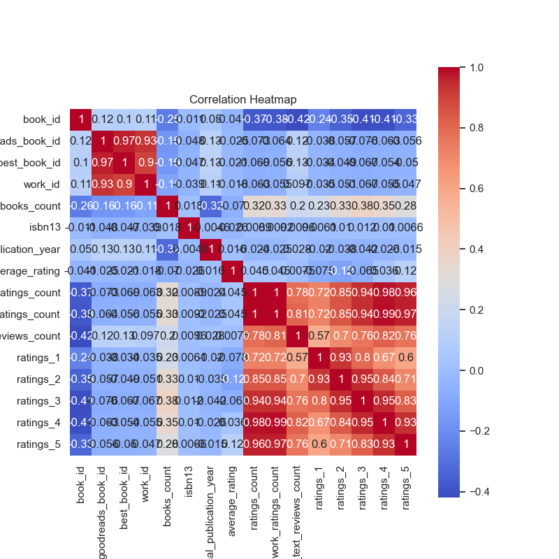

### Detailed Narrative of Data Analysis on Goodreads Dataset

The analysis of the data from the `goodreads.csv` file reveals a comprehensive view of book ratings, authors, and publication trends within a sample of 10,000 books. Below is a structured narrative focusing on key insights, trends, outliers, anomalies, and suggestions for further exploration.

#### Overview of Key Columns and Data Types

The dataset contains various attributes, including identifiers for books (like `book_id`, `goodreads_book_id`, `best_book_id`, and `work_id`), attributes related to the book's metadata (like `authors`, `original_publication_year`, `title`, and `language_code`), and metrics related to user interaction, such as `average_rating`, `ratings_count`, and breakdowns of individual ratings (1-5 star ratings).

#### Summary Statistics Insights

1. **Publication Trends**:
   - The mean `original_publication_year` is approximately 1982, with a distribution indicating a large number of books published in the '90s and 2000s, as suggested by the interquartile range [1990, 2011]. The minimum year of publication is notably as far back as 1750, which may warrant validation to ensure it is not a data entry error.
   - This data can help in understanding what books were more influential or relevant in various eras, guiding curated reading lists or further audience research.

2. **Author Popularity**:
   - There are 4,664 unique authors, with Stephen King being the most frequently mentioned (60 occurrences). This could indicate his significant popularity and demand, suggesting that readers gravitate towards well-known authors.
   - Analyzing the distribution of ratings across different authors may reveal patterns in reader engagement associated with specific strengths or weaknesses.

3. **Rating Metrics**:
   - The average rating across all books is approximately 4.00, with a standard deviation of 0.25, indicating a generally positive reception from readers. There are notable outliers in both high and low ratings, particularly for the `ratings_5` metric, which has a maximum of 3,011,543, suggesting some titles may have garnered extensive reader attention.
   - There is a negative correlation between the `average_rating` and various rating counts (particularly `work_ratings_count` and `ratings_count`), suggesting that while some books are rated highly, they may not have a high volume of ratings—possibly indicating that high ratings come from a more niche audience.

#### Correlation Matrix Observations

1. **Work Ratings Relationships**:
   - A strong correlation exists between `work_ratings_count` and `ratings_count` (0.995), which implies that books that are rated more often tend to have higher overall engagement.
   - The substantial correlations between individual ratings (1-5 stars) suggest that readers tend to distribute their ratings in a consistent manner, with high ratings being positively correlated across the board.

2. **Impact of Book Count**:
   - `books_count` displays a negative correlation with average ratings and work-related counts. This indicates that books with a larger quantity associated (possibly a series of works) may receive lower average ratings, warranting a deeper examination into series versus standalone works.

#### Missing Values and Data Quality

Significant missing values were observed in fields like `isbn` (700 missing), `isbn13` (585 missing), and `original_title` (585 missing). The missing data may hinder comprehensive analysis, especially affecting the ability to triangulate on book identity and publication details. It's advisable to clean or impute these gaps for improved analysis reliability.

#### Suggestions for Further Analysis

1. **Clustering Analysis**:
   - Employ clustering techniques (e.g., K-Means) to group books based on `average_rating`, `ratings_count`, and potentially `authors`. This could uncover distinctive categories of books, like popular reads, niche books, or underappreciated gems.

2. **Anomaly Detection**:
   - Implement anomaly detection algorithms to identify books that have received unusually high or low ratings compared to their expected performance based on factors like publication year or author popularity. These outliers could be revisited for marketing strategies or promotional insights.

3. **Sentiment Analysis**:
   - Extend analysis to include text reviews, if available, using sentiment analysis to assess why certain books attract favorable or unfavorable ratings. This analysis can reveal qualitative insights that quantitative ratings alone cannot provide.

4. **Time Series Analysis**:
   - Conduct a time-series analysis on the `original_publication_year` versus the `average_rating` to identify trends in how reader preferences have changed over time, linking authors' and genres' popularity with cultural or societal shifts.

#### Implications for Future Decisions

Understanding trends and patterns gleaned from this dataset can significantly impact marketing strategies, acquisition decisions (for acquiring similar titles or engaging popular authors), and reader engagement efforts (such as creating lists featuring trending authors or years in specific genres). Moreover, continuous monitoring and analysis of newly added titles will allow for adaptable strategies to align with changing reader preferences. 

Overall, this thorough analysis indicates a vibrant literary scene reflected through reader engagement on Goodreads, offering many opportunities for actionable insights into both past successes and future trends.

