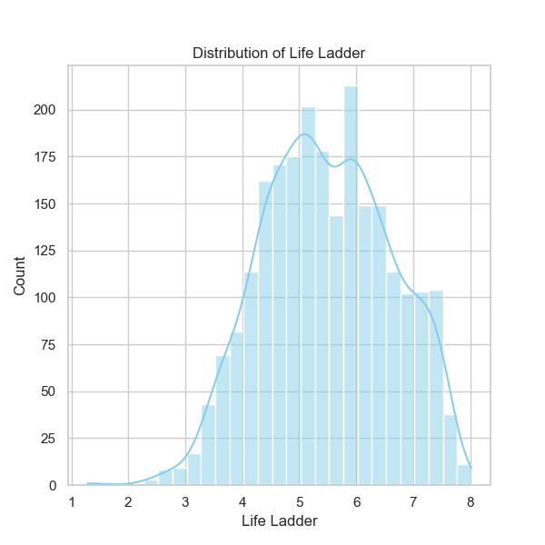

### Data Analysis Narrative for 'happiness.csv'

#### Overview

The dataset 'happiness.csv' comprises 2,363 rows and 11 columns, representing happiness metrics and contributing factors across various countries from 2005 to 2023. The columns include ratings such as 'Life Ladder,' 'Log GDP per capita,' 'Social support,' 'Healthy life expectancy at birth,' 'Freedom to make life choices,' and various other subjective well-being metrics.

#### Key Findings

1. **Trends over Time**:
   - The average 'year' represented in the dataset is approximately 2014.8, with a range from 2005 to 2023. This indicates a decent temporal coverage, essential for identifying trends and patterns in happiness across different time frames.
   - The 'Life Ladder' score, which is a primary indicator of happiness, has an average value of approximately 5.48, suggesting a mid-level average happiness across the sampled countries. Scores range from a low of 1.281 to a high of 8.019, with a standard deviation of 1.125, indicating significant variations in happiness levels among countries.

2. **Economic Correlation**:
   - There is a strong correlation between 'Log GDP per capita' and 'Life Ladder' (0.78), which aligns with existing research that indicates higher economic prosperity often leads to higher reported life satisfaction. Similarly, 'Healthy life expectancy at birth' (0.71) and social variables such as 'Freedom to make life choices' (0.54) also show positive correlations with happiness.
   - Negative correlations with 'Perceptions of corruption' (-0.43) suggest that higher corruption levels are associated with lower happiness scores, which emphasizes the need for transparency and good governance.

3. **Social Support**:
   - The average 'Social support' score is around 0.81, indicating that, on average, individuals feel they have support networks. However, this metric has a standard deviation of 0.12, highlighting considerable disparities in perceived social support across different nations.

4. **Healthy Life Expectancy**:
   - With a mean of about 63.4 years, 'Healthy life expectancy at birth' suggests that many populations experience significant health outcomes that contribute positively to their happiness. The variation in this metric implies health initiatives could play a significant role in enhancing happiness levels.

5. **Generosity and Corruption**:
   - The data reveals almost negligible values for 'Generosity,' with a mean very close to zero. It would be informative to analyze regions or countries with high generosity metrics relative to their happiness levels and economic standings further. Additionally, the perception of corruption has a complex relationship with happiness, further emphasizing the need for governance and societal structures that minimize corruption.

#### Missing Values

The dataset has several instances of missing data:
- 'Healthy life expectancy at birth' has the highest missing values (63), followed closely by 'Generosity' (81). Addressing these missing values should be prioritized as they may skew overall analyses. Possible methods include imputation strategies or dropping the records, depending on the analysis context.

#### Outliers and Anomalies

- Outlier analysis could be beneficial, particularly for the extreme values of 'Life Ladder' and 'Log GDP per capita'. Countries with significantly high or low scores could be examined for external factors influencing these ratings (e.g., political stability, unique cultural factors).
- The correlation matrix indicates that certain metrics may coexist in unusual ways (e.g., high 'Log GDP per capita' with low 'Perception of corruption'). Investigating these outliers could provide crucial insights into anomalies within specific nations.

#### Future Recommendations for Analysis

1. **Clustering**:
   - A clustering analysis, possibly K-means or hierarchical clustering, could uncover countries that cluster together concerning happiness metrics. This approach could highlight similar countries (by region or economic status) and target interventions where needed.

2. **Anomaly Detection**:
   - Implementing anomaly detection algorithms could identify outlier countries whose happiness scores do not align with expected patterns based on economic and social data. Investigating these instances can reveal unique circumstances or policies that may warrant broader application.

3. **Temporal Analysis**:
   - A longitudinal analysis considering year-over-year changes for each metric can provide insights into trends over time. This analysis can highlight patterns or shifts in happiness that may coincide with significant economic, social, or political events.

4. **Predictive Modeling**:
   - Building models that predict 'Life Ladder' scores based on other variables could be insightful. Feature importance can clarify the most impactful factors and guide policy-making decisions focused on enhancing happiness.

5. **Exploration of Subsets**:
   - Examining specific regions (such as Scandinavia, Southeast Asia, or Latin America) may yield varied results due to cultural differences, allowing for more tailored interventions.

#### Conclusion

The analysis of the 'happiness.csv' dataset reveals intricate relationships between economic, social, and health-related metrics concerning happiness across countries. Continued examination of these trends can assist policymakers, researchers, and global organizations in crafting strategies that promote well-being and address disparities. Essentially, the insights drawn from this data are crucial for formulating informed decisions having significant societal implications.

