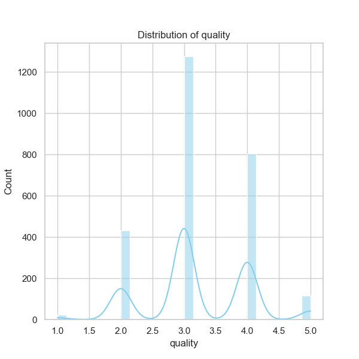

### Narrative Based on `media.csv` Analysis

#### Overview
The dataset `media.csv` contains information about different media entries, characterized by columns such as `date`, `language`, `type`, `title`, `by`, `overall`, `quality`, and `repeatability`. The analysis reveals several insights regarding media trends and characteristics, with particular emphasis on statistical summaries, correlation analysis, and the impact of recorded data points.

#### Summary of Key Findings

1. **Date Distribution**:
   - The dataset includes 2553 entries dated across 2055 unique dates, indicating a significant time range in the data. The most frequent date is '21-May-06', appearing 8 times. Given that data spans multiple years but only a few dates dominate, it suggests possible clustering of recordings or submissions.

2. **Language and Type**:
   - There are 11 unique languages represented in the dataset, with English being the most common, appearing in 1306 entries. The distribution is predominantly skewed towards English media.
   - The media type is extensively categorized under 8 different categories, with "movie" being the most common type across 2211 instances, accounting for a significant percentage of the total data.

3. **Title and Creators**:
   - The data also illustrates a rich diversity in titles, with 2312 unique titles. However, certain titles, such as "Kanda Naal Mudhal," appear disproportionately often (9 times).
   - The entries are credited to 1528 unique creators, with Kiefer Sutherland as the most frequently listed creator, appearing in 48 entries. This raises the potential for both typical genre trends and a focus that might favor specific creators.

4. **Quality Metrics**:
   - The average scores for `overall`, `quality`, and `repeatability` provide an interesting snapshot:
     - Mean overall score: **3.05**
     - Mean quality score: **3.21**
     - Mean repeatability score: **1.49**
   - The `overall` and `quality` metrics have a strong positive correlation (0.826), indicating that higher quality media tends to receive better overall scores. Conversely, repeatability shows a moderate positive correlation with overall scores (0.513) but a weaker correlation with quality (0.312).

5. **Missing Data**:
   - Notably, there are 99 missing values in the `date` field, alongside 262 missing entries in the `by` column. This could potentially bias analyses revolving around time or creator attribution.

6. **Correlations**:
   - High correlations suggest that media of higher quality consistently receives better overall ratings, while lower repeatability scores might indicate less consistent media experiences.

#### Trends, Patterns, and Anomalies

- **Dominance of English Movies**: The disproportionate frequency of English-language movies suggests a market bias, possibly limiting diversity in media consumption. This could reflect broader trends in media production, distribution, and audience preferences.
  
- **Title Popularity**: The repeated appearance of certain titles suggests either their popularity or a potential limitation in the dataset regarding media that is more recurrently watched or released. 

- **Creator Bias**: The prominence of a few individuals (like Kiefer Sutherland) infers a possible concentration of talent within specific genres or media types, impacting how audiences perceive media quality.

#### Suggested Further Analyses

1. **Clustering Analysis**:
   - Implement clustering algorithms (e.g., K-means or hierarchical clustering) to group media entries based on their attributes (e.g., language, type, overall rating). This could help identify niche segments or uncover patterns in viewer preferences.
  
2. **Temporal Analysis**:
   - An analysis of trends over time could reveal popularity shifts in genres, creators, or languages, which might guide strategic decisions for content production or marketing.

3. **Anomaly Detection**:
   - Conduct anomaly detection on the quality metrics to identify potential outliers that may skew ratings—either particularly high or low ratings could indicate media worth further investigation or special marketing attention.

4. **Impact Assessment**:
   - Analyze if certain characteristics (like creator or type) significantly influence overall and quality scores. This could guide future media development strategies.

#### Strategic Implications

Understanding these data trends can significantly influence decision-making in content creation and marketing strategies. Enhancing diversity in language and types of media might attract broader audiences, while promoting quality creators identified through this analysis can enhance brand loyalty and trust. Additionally, mitigating the identified patterns regarding missing data will enhance data integrity and support better future analyses. By addressing these insights, organizations can harness existing strengths while improving on evident weaknesses.

